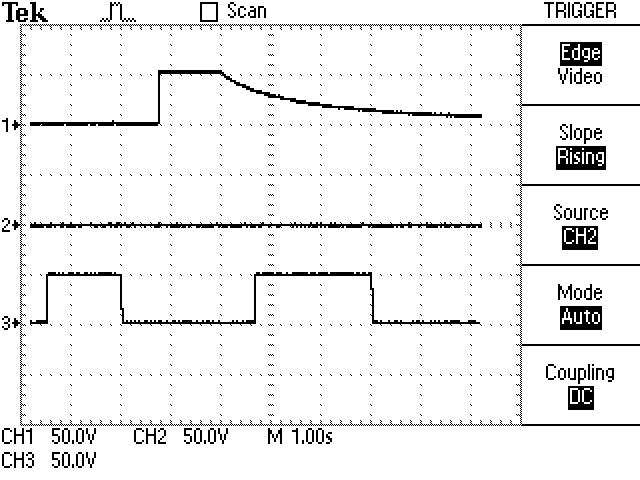

# Introduction

Project goals:
- When the PV system generates more energy than my house uses, store excess in batteries.
- When the house needs more energy that the PV system generates, supply from batteries.

This wants an "AC Coupled storage system".

Storing into batteries is easy, use an AC powered battery charger with
current control to charge the battery bank off the regular house AC.

How to supply from batteries?
- Large current-controlled micro-inverter?
- Multiple smaller micro-inverters, turn on/off as needed?


# Batteries

Manufacturer: American Battery Solutions

Product line: Alliance

Model: E48-2.0

Cell connections: 14S 8P


## Wire harness

Net      | Harness pin | Wire color
-------- | ----------- | ----------
Ign Low  | 2           | Blue (short to BAT- to ignite the battery)
CAN+ In  | 10          | Orange
CAN- In  | 9           | Black
CAN- Out | 7           | Purple
CAN+ Out | 6           | Gray


## CAN

Lots of good info in the Alliance User Manual.

There's an app in the `battery/` directory that controls the mode
and reports telemetry.

The modules collaborate over CAN to charge the low modules and discharge
the high modules in the expected way.  The following scope trace shows the
terminal voltage of two modules connected via CAN but not connected via
their high-voltage terminals.  The module on probe 1 is charged to ~50V,
the module on probe 2 is charged to ~48V.  The pack starts out in Sleep
mode, where no modules are connected to the HV bus.  First i command the
pack to Drive/Discharge mode; the 50V module turns on its HV terminals
and the 48V module remains disconnected.  Then i command the pack to
Charge mode; the high-voltage module disconnects from the HV bus and
about a half second later the low-voltage module connects to the HV bus.



```
CAN ID 0x502: `HOST_BatteryRequest`
    Payload: `HOST_stateRequest`, 1 byte
        0x00: None
        0x01: Drive/Discharge (power output)
        0x02: Charge (power input)
        0x03: Sleep
    Send this packet at 1 Hz
```

To ignite the battery from Linux over CAN and put it into Drive mode:
```
$ sudo ip link set can0 down
$ sudo ip link set can0 up type can bitrate 500000
$ while true; do cansend can0 '502#01.00'; sleep 1; done
```

To ignite the battery and put it into Charge mode, which makes it request
charge from the DeltaQ charger if it sees its CAN heartbeat:
```
$ while true; do cansend can0 '502#02.00'; sleep 1; done
```

To capture a CAN packet log:
```
$ candump -t a -l -f battery.candump can0
```

To replay a captured candump packet log:
```
$ sudo modprobe vcan
$ sudo ip link add dev vcan0 type vcan
$ sudo ip link set vcan0 up
$ canplayer -I battery.candump vcan0=can0
```


## Misc

Short the `IGN Low` pin to `BATT-` i think, and if the pack has
enough charge to boot the internal bms it'll energize `BATT+`.

Nathaniel says: I had one pack never shutoff after I turned it on with
an ignition signal, which is the main reason I no longer want to use
the pack BMS.


# Charger

Delta-Q
- Model: ICL 1500-058v
- Part number: 943-0016


## CAN

The one i have runs CAN at 500 kbps and uses different CAN packets than
what's in the docs.

CAN-H is blue
CAN-L is yellow

This makes it charge at 50 V, 2 A:
```
$ sudo ip link set can0 down
$ sudo ip link set can0 up type can bitrate 500000
$ while : ; do cansend can0 '30a#00.00.00.02.00.32.80.01'; cansend can0 '20a#00.31.01.00.32.20.00.01' ; sleep 1 ; done
```

The charger gets hot after a few minutes at higher current, but eventually
the fan comes on and cools it down.


# Inverters

I want a programmable inverter so I can tell it how much power to push
from the batteries to the home grid

48V in, 240V split phase out


## Grid-forming

Grid-forming inverters supply voltage and frequency support to the grid,
as well as power.  This is needed for black start (bringing up the grid
after an outage).  Different modes of operation, such as: droop control,
virtual synchronous machine, hierachichal control, etc.

- PowerFlex 755T from Rockwell Automation
- Sunny Island from SMA Solar Technology
- PowerStore from ABB
- GridMaster from Ideal Power


## Grid-following

Grid-following: supplies power, but must receive voltage and frequency from the grid.


## Misc info, open questions

Good info:
- <https://energycentral.com/c/iu/grid-forming-vs-grid-following>
- (terrible presentation) <https://www.youtube.com/watch?v=zWj21MMHPJc>
- <https://www.youtube.com/watch?v=RKQo9metcpU>

Some inverters can be both grid-forming and grid-following?

connecting inverters in parallel?  They must be grid-following, except
maybe one that "supplies voltage and frequency"?

Scenarios:
- grid tied
- grid tied system responds to grid disconnect
- island/off-grid (are these synonymous?)
- island reconnects to the grid
- black start

microgrids, islanded grids, large-scale grids

how does the enphase battery connect to the microgrid?  Does it go into the Combiner?


## Inverter Options

The internet thinks:
- "Enphase uses microinverters on their battery systems. They just stack them together."
- "With AC PV, the best options to power the entire main panel are EG4 18kPV, Midnite The One, or the Sol-Ark 15k. If you need more inverter, then parallel a 2nd or 3rd ..." <https://diysolarforum.com/threads/add-batteries-to-existing-solar-array-with-enphase-microinverters-and-iq-combiner.91153/post-1210119>

Inverters:
- Enphase M215/M250
    - <https://enphase.com/store/microinverters/legacy/m250-microinverter-kit>
- Enphase IQ8X-BATT
    - <https://enphase.com/download/iq8x-bat-microinverter-data-sheet>
    - Needs 52.5 VDC to start?
- Enphase IQ8+
    - runs on 16–58 V DC input
- Schneider Conext XW+ 6848
    - discontinuesd
- SunnyBoy
- Northern Electric BDM-600X
    - <https://northernep.com/downloads/technical-sheet/BDM-600X-Microinverter.pdf>


# Links & info

## Enphase Sunlight Backup

This is an Enphase design that keeps "limited loads" running when the
grid goes down, without battery storage.

- solar panels
- IQ8 micro-inverters with IQ8 cabling (this works with or without the grid when the needed additional equipment is present)
- IQ Combiner (includes IQ Gateway, solar production CT, 2 consumption CTs, enphase wireless comm kit)
- IQ System Controller (disconnects from the grid during outage)
- System shutdown switch
- Load center/subpanel (this is a subpanel that stays powered during outage)


## Misc

Probably do this: <https://university.enphase.com/?ccode=US&lang=en>

DIY Solar folks brainstorming a system very similar to what i want:
<https://diysolarforum.com/threads/adding-an-ess-to-enphase-enlighten-system.42737/>

<https://diysolarforum.com/threads/adding-diy-batteries-to-enphase-grid-tie-system.39487/>

<https://diysolarforum.com/threads/do-you-need-a-subscription-or-gateway-to-view-enphase-micro-inverter-data.92441/>

<https://diysolarforum.com/threads/using-solar-micro-inverters-with-batteries-instead-of-panels.8353/>

Enphase design guides: <https://enphase.com/installers/training/getting-started/design>
